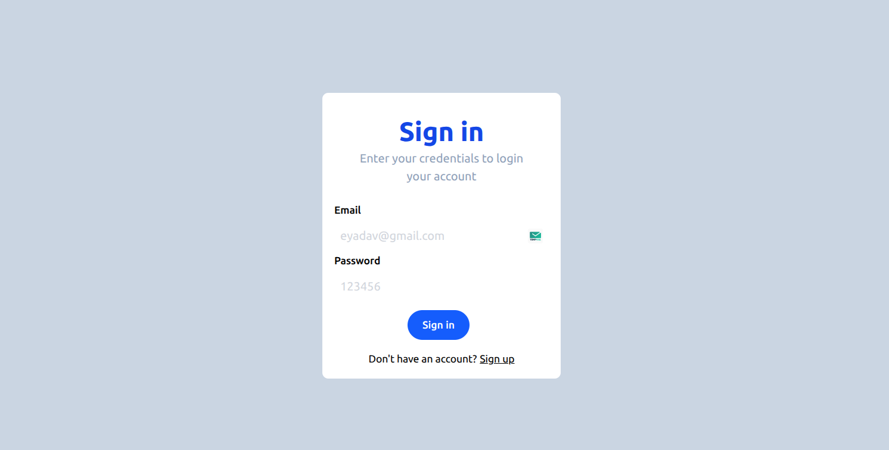
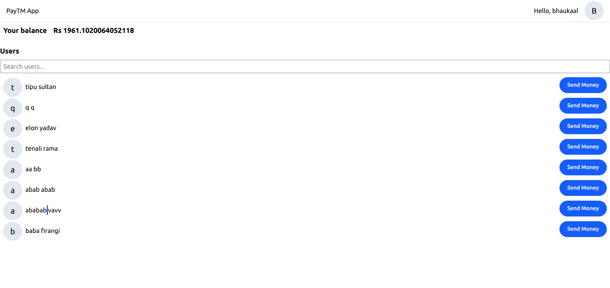

# 💰 Simplified Paytm Wallet Clone

A simplified clone of the Paytm wallet system built with **Node.js, Express, MongoDB, and React**. This project demonstrates full-stack development with user authentication and peer-to-peer money transfers.

---

## 🚀 Features

- ✅ User Sign Up & Sign In (JWT-based auth)
- ✅ MongoDB-based user and account management
- ✅ React frontend with Vite
- ✅ Random balance on account creation
- ✅ Auth-protected dashboard and transfer routes
- ✅ Send money between users
- ✅ Basic route protection using auth middleware

---

## 🧪 Tech Stack

| Layer     | Technology                  |
|-----------|-----------------------------|
| Backend   | Node.js, Express, MongoDB   |
| Auth      | JWT (JSON Web Tokens)       |
| Frontend  | React (Vite)                |
| DB Client | Mongoose                    |
| UI Style  | Tailwind CSS      |

---

## 📸 Screenshots

| Auth Page | Dashboard | Send Page |
|----------|-----------|-----------|
|  |  |  |

---

## 🛠️ Setup Instructions

1. **Clone the repo**
   ```bash
   git clone https://github.com/your-username/paytm-wallet-clone.git
   ```

2. **Install backend dependencies**
   ```bash
   cd backend
   npm install
   ```

3. **Set up `.env`**
   ```
   DB_URL=<your-mongodb-url>
   JWT_SECRET=<your-secret-key>
   ```

4. **Run the backend**
   ```bash
   node index.js
   ```

5. **Install frontend dependencies**
   ```bash
   cd ../frontend
   npm install
   ```

6. **Run the frontend**
   ```bash
   npm run dev
   ```

---

## 🧭 Folder Structure

```
paytm-wallet-clone/
├── backend/
│   ├── routes/
│   ├── utils/
│   └── index.js
├── frontend/
│   └── src/
│       ├── pages/
│       └── components/
```

---

## 🔒 TODO / Planned Improvements

- [ ] Google Login with OAuth 2.0
- [ ] Transaction History for each user
- [ ] Logout flow & token expiry handling
- [ ] UI/UX polish
- [ ] Dockerized setup
- [ ] Unit tests and e2e tests

---

## 📜 License

MIT